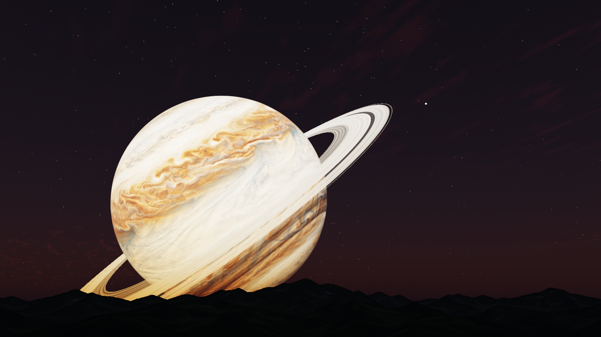

# Gas Giant Observatory

A fixed view from a green mountain ridge on a synchronously rotating moon.
A large gas giant hangs above the mountains while twenty eccentric moons move
through a shared 3D system. Slender, translucent ice rings share the giant’s
tilted equator. Sunlight, phases and eclipse shadows follow that
geometry. The sky changes through a 30-minute solar day, with thin drifting
clouds and stars emerging at dusk.



[Animated preview](assets/preview.webp) · [MP4](assets/preview.mp4) · [Daylight](assets/preview-day.png) · [Eclipse](assets/preview-eclipse.png)

## Run on NixOS / Hyprland

```sh
nix run github:mkaszynski/gas-giant-screensaver -- --fullscreen
```

Press **Escape** or **Q** to close. The preview does not lock the desktop.
It caps rendering at 30 fps and stops when Hyprland reports a display powered
off. Use `--fps 15` for a lower frame budget, or `--timeout 20` for a brief preview.

From a checkout:

```sh
nix run . -- --fullscreen --timeout 20
```

## Native lock screen

The optional package uses Hyprlock's native session lock and PAM authentication.
It retains the cyan password segments, Orbitron status text, red failure halo,
three-second failure hold, and 800 ms deceleration plus 1000 ms unlock fade of
the Hyperspace Starfield setup. Rendering pauses when the compositor stops
sending frames to an inactive output.

Validate the config without locking:

```sh
nix run .#gas-giant-lock -- --check-config
```

Activate the actual lock (unlock with your normal account password):

```sh
nix run .#gas-giant-lock
```

For Home Manager, add this repository as a flake input, select
`inputs.observatory.packages.${pkgs.stdenv.hostPlatform.system}.hyprlock-observatory`
as `programs.hyprlock.package`, and use `hyprlock/observatory.conf` as the lock
configuration. NixOS needs `security.pam.services.hyprlock = {};` as usual.
Installing the preview does not change any host configuration or idle timeout.

## Appearance and geometry

- Giant: Jupiter radius, three Jupiter masses; solar-size star at about 1 AU.
- Observer orbit: semimajor axis **three giant radii**, eccentricity **1/9**.
  Apocenter is exactly **25% farther** than pericenter.
- The observer moon has Earth's **6,371 km radius**. The other nineteen moons
  retain **three times their initial radii**; the largest is about three Earth
  radii. This is a fictional, artist-directed system.
- Observer orbit: **10° inclined to the giant’s equator**. Other moon planes
  span **1–10°** from that same equator, with different nodes.
- Latitude 38° north, longitude 50° from the mean subplanet meridian. Mean
  synchronous rotation preserves natural eccentric-orbit libration.
- Twenty moons includes the observer moon. Visibility and apparent size follow
  geometry; the renderer does not arrange all nineteen others in the frame.
- Rings: **1.235–1.780 giant radii**, with narrow bands and a Cassini-like gap.
  Their plane and the giant’s texture share a **26.7° tilted pole**. Optical
  depth varies by radius and viewing angle; moons remain visible through
  thinner bands. Planet/ring and moon/ring shadows work in both directions.
- Faint nighttime airglow and ambient mountain light preserve subtle detail.
- Finite solar disk (about 0.53° across), atmospheric aureole, soft optical glare,
  mutual eclipses, and planetshine approximation.
- Photographic-style generated mountain albedo and giant band textures; runtime
  lighting supplies their changing appearance. Mountain interiors fully occlude
  the sky, with antialiasing restricted to the silhouette.

## Gas giant atmosphere

The giant has a thin, physically scaled hydrogen/helium atmosphere above its
cloud deck. A 280 K reference temperature, mean molecular mass of 2.3 atomic
mass units and this giant’s gravity give a **13.6 km scale height**. Molecular
scattering favors blue wavelengths; a very faint, nearly neutral haze adds
forward scattering. The chosen temperature, 0.1-bar cloud-top pressure and haze
are plausible parameters for this fictional warm giant, not measurements of an
Earth-distance Jupiter. Solar illumination uses the same normalization as the
clouds and rings: there is no special eclipse brightness boost.

The atmospheric arc is most distinctive close to eclipse contact. It responds
to the finite Sun, the giant’s own shadow, moon shadows and translucent ring
shadows. At this close observer distance a central eclipse can hide the entire
sunlit atmospheric limb; a glowing ring throughout totality is not imposed.
The ordinary day/night appearance changes only subtly.

[Actual eclipse-contact capture](assets/preview-atmosphere-contact.png)

```sh
nix run . -- --fullscreen --time 376368
```

A small static lookup and a narrow, antialiased limb integration keep the cost
bounded. There is no atmospheric bloom or enlarged glowing shell. This is a
single-scattering approximation; atmospheric refraction and multiple scattering
inside the giant’s atmosphere are not simulated. Details and numerical checks:
[design](docs/DESIGN.md#gas-giant-atmosphere) and [validation](docs/VALIDATION.md#gas-giant-atmosphere).

## Performance

The renderer is C++20 / OpenGL ES 3.0. A cached transmittance table and an
isotropic multiple-scattering table feed a small sky lookup texture. Only the
sky table changes during the day. Sphere draws are bounded to screen rectangles;
impossible shadow casters are rejected on the CPU. Clouds are thin texture
layers, and solar glare adds no extra rendering pass. There is no runtime AI,
network access, volumetric cloud marching, or per-frame texture upload.

Measurements and limitations: [validation report](docs/VALIDATION.md).
The frame cap and output suspension matter more for power than peak FPS.

## Build and test

```sh
nix develop
cmake -S . -B build -G Ninja -DCMAKE_BUILD_TYPE=Release
cmake --build build --parallel
ctest --test-dir build --output-on-failure
./build/render-tests
./build/ring-render-tests
./build/edge-render-tests
./build/atmosphere-render-tests
./build/scattering-edge-tests
./build/emission-render-tests
nix flake check
```

Use `--no-rings` for a direct visual or performance comparison.

GPU tests need a display and GLES 3. CI runs them using Mesa llvmpipe and Xvfb.
They check opaque mountain occlusion, deterministic resize, visible bodies,
and day/night contrast. Unit tests verify orbital geometry and eclipse cases.

Capture and measure the real renderer:

```sh
nix run . -- --capture twilight.png --time 1180 --width 1920 --height 1080
nix run . -- --benchmark 180 --time 900 --width 1920 --height 1080
```

`--time` sets the starting scene time; `--capture` freezes it. Normal launches
continue from wall-clock-derived celestial time. `--day-seconds` changes the
speed of the system. See `--help` for recording options.

## Lightning and auroras

Water-cloud thunderstorms produce small, brief glows on the giant. Flash frequency and
duration follow the orbital simulation speed (about 17.8× at the default
30-minute day). Sub-frame pulses retain their energy through exposure integration.
Persistent, thin polar auroras use visible-light brightness estimates; they are
intentionally faint and usually lost against daylight. Geometry, foreground
moons, translucent rings, local clouds and mountains control their visibility.

Use `--weather-time SECONDS` for a reproducible weather starting time, or
`--no-emissions` for a comparison. See [physical assumptions, sources and
rendering details](docs/EMISSIONS.md).

## Scope and provenance

This is a purpose-built screensaver, not an orbital habitability simulator.
Keplerian paths are prescribed; long-term N-body stability is not claimed.
Mountains are a fixed photographic-style layer, not navigable terrain.
Atmospheric eclipses use local visibility rather than a volumetric shadow
integration; overlapping penumbras use an approximation. See
[design](docs/DESIGN.md) and [asset provenance and prompts](docs/ASSETS.md).

## License

The original renderer is released under the standard [MIT License](LICENSE). Hyprlock integration incorporates BSD-3-Clause upstream
code and attributed UX patches. Generated assets: CC0-1.0 to the extent rights
exist. See [LICENSE](LICENSE) and [attribution](docs/ASSETS.md).
